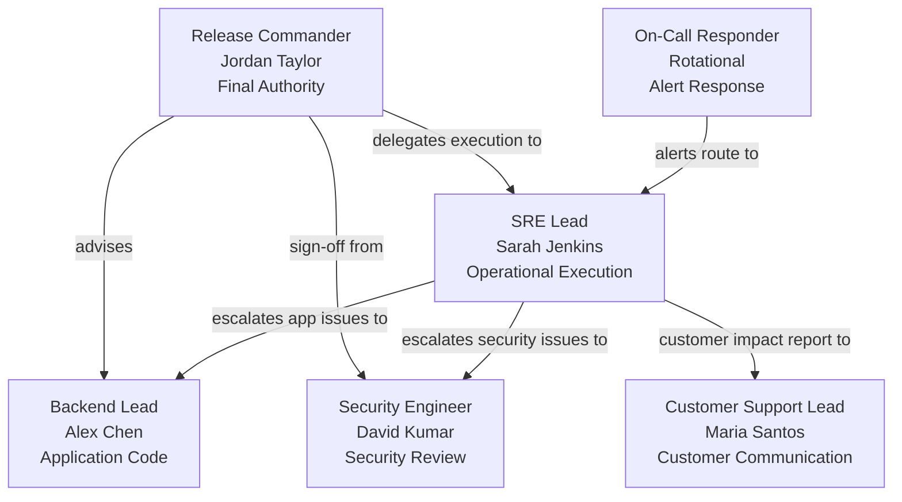

# Deployment Ownership & Escalation Document

**Release:** Checkout API `v2.4`  
**Target Environment:** Production Kubernetes (`checkout-system` namespace)  
**Deployment Window:** 2026-08-22, 02:00 – 04:00 UTC (low-traffic maintenance window)  
**Document Owner:** Release Engineering  
**Effective Date:** 2026-08-20  

---

## 1. Purpose

This document assigns explicit, named ownership for every role involved in the `v2.4` deployment window. An "orphaned deployment" — where no single person owns the outcome — is the most common cause of extended incident MTTR. This document eliminates that gap.

---

## 2. Role Assignments

| Role | Responsibility | Primary Owner | Contact | Escalation |
| :--- | :--- | :--- | :--- | :--- |
| **Release Commander** | Final go/no-go authority; leads deployment window; sign-off required | Jordan Taylor | `@jordan.taylor` on Slack / `+1-555-010-0001` | Sarah Jenkins (SRE Lead) |
| **SRE / Operational Lead** | Executes deploy script; monitors telemetry & SLOs; triggers rollback if threshold breached | Sarah Jenkins | `@sarah.jenkins` on Slack / `+1-555-010-0002` | Jordan Taylor (Release Commander) |
| **Backend Engineering Lead** | On-call for application-level bugs during deploy window; owns hotfix if required | Alex Chen | `@alex.chen` on Slack / `+1-555-010-0003` | Jordan Taylor |
| **Security Engineer** | Verifies container security posture prior to deployment; reviews patch compliance | David Kumar | `@david.kumar` on Slack / `+1-555-010-0004` | Jordan Taylor |
| **On-Call First Responder** | Active Pager Duty rotation; first to respond to automated alerts | Rotational | PagerDuty schedule: `checkout-api-prod` | Sarah Jenkins |
| **Customer Support Lead** | Monitors support queues during window; communicates status to customers if impacted | Maria Santos | `@maria.santos` on Slack / `+1-555-010-0005` | Jordan Taylor |

---

## 3. Responsibility Boundary Map



---

## 4. Pre-Deployment Sign-Off Requirements

All individuals below must confirm readiness before the deployment window opens. Sign-off must be recorded in the PR comments thread.

| # | Item | Sign-off Owner | Status |
| :---: | :--- | :--- | :---: |
| 1 | All 3 Critical release blockers resolved (RSK-001, RSK-002, RSK-003) | Alex Chen (Backend Lead) | ⏳ **Pending** |
| 2 | `checkout-api-secrets` created and verified in `checkout-system` namespace | Sarah Jenkins (SRE Lead) | ⏳ **Pending** |
| 3 | Container security review passed (non-root user, no secret in ConfigMap) | David Kumar (Security Engineer) | ⏳ **Pending** |
| 4 | Rollback procedure rehearsed and `scripts/rollback.sh` validated | Sarah Jenkins (SRE Lead) | ✅ **Verified** |
| 5 | Production alerting rules configured for deployment window | Sarah Jenkins (SRE Lead) | ⏳ **Pending** |
| 6 | Final go/no-go decision made and documented in `readiness-report.md` | Jordan Taylor (Release Commander) | ⏳ **Pending** |

---

## 5. Deployment Window Schedule

| Time (UTC) | Activity | Owner |
| :--- | :--- | :--- |
| **02:00** | Deployment window opens; pre-deployment health baseline captured | Sarah Jenkins |
| **02:05** | Deploy `checkout-api-secrets` secret to cluster | Sarah Jenkins |
| **02:10** | Deploy updated `k8s/configmap.yaml` | Sarah Jenkins |
| **02:15** | Execute `scripts/deploy.sh` — roll out Checkout API `v2.4` | Sarah Jenkins |
| **02:15 – 02:25** | Actively monitor rollout, error rates, latency, and health probes | Sarah Jenkins |
| **02:25** | Run post-deployment verification checklist (all 6 gates from rollback plan) | Sarah Jenkins + Alex Chen |
| **02:35** | Release Commander declares deployment stable or triggers rollback | Jordan Taylor |
| **02:40** | Customer Support Lead clears queue; mark deployment complete | Maria Santos |
| **04:00** | Deployment window closes (extended to 04:00 for rollback buffer if needed) | Jordan Taylor |

---

## 6. Escalation Path

```text
On-Call Alert Triggered
    └─→ On-Call Responder (ACK within 5 min)
            └─→ SRE Lead: Sarah Jenkins (ACK within 10 min)
                    └─→ Backend Lead: Alex Chen (app code issues)
                    └─→ Security Engineer: David Kumar (security events)
                            └─→ Release Commander: Jordan Taylor (final decisions)
                                    └─→ VP Engineering: [Exec Escalation] (SLA breach or data loss)
```

### Escalation Time-Boxes
- **Alert → First Ack:** Max 5 minutes
- **First Ack → Assessment:** Max 10 minutes  
- **Assessment → Rollback Decision:** Max 15 minutes
- **Maximum tolerated incident window (before forced rollback):** 30 minutes post-detection

---

## 7. Post-Deployment Handoff

After the window closes and deployment is stable:
- SRE Lead publishes a brief deployment summary to `#release-announcements`.
- PagerDuty rotation resumes standard on-call schedule.
- Backend Lead monitors error rates for 24 hours post-deployment.
- Release Commander archives this ownership document in the release notes.
