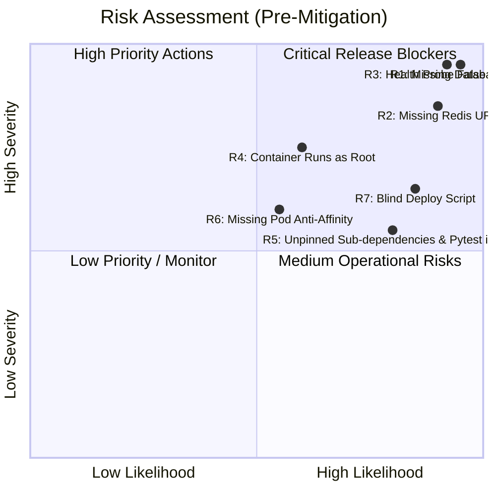

# Production Risk Analysis & Mitigation Matrix

**Release Candidate:** Checkout API `v2.4`  
**Evaluation Date:** 2026-08-20  
**Evaluator:** Release Engineering & SRE Team  

---

## 1. Risk Assessment Methodology

Each identified operational, architectural, and security risk is evaluated using a standard 5x5 Severity × Likelihood matrix to determine the pre-mitigation and post-mitigation Risk Score.

| Severity Level | Definition | Likelihood Level | Definition |
| :--- | :--- | :--- | :--- |
| **Critical (5)** | System outage, data loss, financial impact | **High (5)** | Guaranteed or near-certain to occur |
| **High (4)** | Severe degradation, security vulnerability | **Medium (3)** | Likely under normal production conditions |
| **Medium (3)** | Moderate impact, workaround available | **Low (2)** | Possible under edge-case conditions |
| **Low (1-2)** | Minimal impact, cosmetic | **Rare (1)** | Highly improbable |

*Risk Score = Severity × Likelihood (Range: 1 – 25)*  
- **Score 15 – 25:** High/Critical Risk (Release Blocker)
- **Score 8 – 14:** Medium Risk (Mitigation required prior to general availability)
- **Score 1 – 7:** Low Risk (Acceptable with monitoring)

---

## 2. Risk Evaluation Matrix

---

## 3. Detailed Risk Register

### Risk 1: Missing Database Configuration & Silent SQLite Fallback
- **Risk ID:** `RSK-001`
- **Category:** Data Integrity / Multi-Pod State
- **Pre-Mitigation Severity:** `Critical (5)` | **Likelihood:** `High (5)` | **Risk Score:** `25`
- **Description:** `k8s/configmap.yaml` omits `DATABASE_URL`. The Flask application silently falls back to an in-memory SQLite instance per pod.
- **Operational Impact:** In a 3-replica deployment, transactions, cart updates, and orders are isolated to individual pods. Customer checkout requests routed across pods fail due to state fragmentation. Pod restarts cause catastrophic data loss.
- **Mitigation Strategy:** 
  1. Create Kubernetes Secret `checkout-api-secrets` containing PostgreSQL credentials.
  2. Bind the secret in `k8s/deployment.yaml`.
  3. Modify `app/app.py` to fail closed if `DATABASE_URL` is absent.
- **Post-Mitigation Score:** `Severity: Low (2) × Likelihood: Low (1) = 2`
- **Owner:** Backend Lead (Alex Chen) & SRE Lead (Sarah Jenkins)

---

### Risk 2: Missing Redis URL & Local Dictionary Cache Desynchronization
- **Risk ID:** `RSK-002`
- **Category:** Caching & Session Management
- **Pre-Mitigation Severity:** `High (4)` | **Likelihood:** `High (5)` | **Risk Score:** `20`
- **Description:** `k8s/configmap.yaml` omits `REDIS_URL`. The app falls back to an in-memory Python dictionary cache.
- **Operational Impact:** Cache invalidations on one pod do not propagate to the other two pods. Customers experience phantom inventory, outdated discounts, and inconsistent cart totals.
- **Mitigation Strategy:** Inject verified `REDIS_URL` via Kubernetes Secret; ensure application connects to central Redis cluster.
- **Post-Mitigation Score:** `Severity: Low (2) × Likelihood: Low (1) = 2`
- **Owner:** Backend Lead (Alex Chen)

---

### Risk 3: Health Check False-Positive Bypassing Kubernetes Probes
- **Risk ID:** `RSK-003`
- **Category:** Observability & Orchestration
- **Pre-Mitigation Severity:** `Critical (5)` | **Likelihood:** `High (5)` | **Risk Score:** `25`
- **Description:** `/health` returns `HTTP 200 OK` and `"status": "healthy"` even when backing services are completely unconfigured and operating on fallback modes.
- **Operational Impact:** Kubernetes `readinessProbe` and `livenessProbe` believe the container is fully functional. Traffic is routed to broken pods, masking critical failures from automated orchestration and monitoring alerts.
- **Mitigation Strategy:** Update `/health` endpoint logic to return `HTTP 503 Service Unavailable` if backing services are in fallback/warning states.
- **Post-Mitigation Score:** `Severity: Low (1) × Likelihood: Low (1) = 1`
- **Owner:** Backend Lead (Alex Chen)

---

### Risk 4: Container Execution as Root User
- **Risk ID:** `RSK-004`
- **Category:** Container Security / Privilege Escalation
- **Pre-Mitigation Severity:** `High (4)` | **Likelihood:** `Medium (3)` | **Risk Score:** `12`
- **Description:** `app/Dockerfile` does not declare a non-root `USER`. The Gunicorn server runs as `root` (UID 0).
- **Operational Impact:** If a remote code execution vulnerability occurs in Flask or dependencies, an attacker gains root privileges inside the container with higher risk of container breakout.
- **Mitigation Strategy:** Add `RUN useradd -r -u 10001 appuser` and `USER 10001` to `Dockerfile`. Enforce `runAsNonRoot: true` in Kubernetes `securityContext`.
- **Post-Mitigation Score:** `Severity: Low (2) × Likelihood: Low (1) = 2`
- **Owner:** Security Engineer (David Kumar)

---

### Risk 5: Non-Deterministic Builds & Test Tooling in Production Image
- **Risk ID:** `RSK-005`
- **Category:** Supply Chain & Container Footprint
- **Pre-Mitigation Severity:** `Medium (3)` | **Likelihood:** `High (4)` | **Risk Score:** `12`
- **Description:** `app/requirements.txt` includes `pytest==8.0.2` and leaves sub-dependencies (Werkzeug, Jinja2, Click) unpinned.
- **Operational Impact:** Future builds may pull breaking transitive releases. Shipping `pytest` and its dependencies expands container attack surface unnecessarily.
- **Mitigation Strategy:** Separate `requirements.txt` and `requirements-dev.txt`. Implement multi-stage Docker build. Use `pip-compile` / lockfile.
- **Post-Mitigation Score:** `Severity: Low (1) × Likelihood: Low (1) = 1`
- **Owner:** Release Engineer (Jordan Taylor)

---

### Risk 6: Lack of Pod Anti-Affinity & Node Failure Vulnerability
- **Risk ID:** `RSK-006`
- **Category:** High Availability & Resilience
- **Pre-Mitigation Severity:** `Medium (3)` | **Likelihood:** `Medium (3)` | **Risk Score:** `9`
- **Description:** `k8s/deployment.yaml` does not define `affinity` or `topologySpreadConstraints`.
- **Operational Impact:** Kubernetes scheduler may place all 3 replicas on the same worker node. A single node crash causes complete service unavailability.
- **Mitigation Strategy:** Add `podAntiAffinity` (preferredDuringSchedulingIgnoredDuringExecution) across `topology.kubernetes.io/zone` and `kubernetes.io/hostname`.
- **Post-Mitigation Score:** `Severity: Low (2) × Likelihood: Low (1) = 2`
- **Owner:** SRE Lead (Sarah Jenkins)

---

### Risk 7: Deployment Script Lacks Pre-flight Validation & Rollback Handling
- **Risk ID:** `RSK-007`
- **Category:** Release Automation
- **Pre-Mitigation Severity:** `Medium (3)` | **Likelihood:** `High (4)` | **Risk Score:** `12`
- **Description:** `scripts/deploy.sh` executes sequential `kubectl apply` without validating prerequisite secrets, cluster connectivity, or performing automated rollback upon failure.
- **Operational Impact:** Failed rollouts require manual intervention and increase MTTR.
- **Mitigation Strategy:** Add pre-flight checks, rollout timeout monitoring, and automated invocation of `scripts/rollback.sh` upon failure.
- **Post-Mitigation Score:** `Severity: Low (1) × Likelihood: Low (1) = 1`
- **Owner:** Release Engineer (Jordan Taylor)

---

## 4. Risk Summary Table

| Risk ID | Title | Category | Pre-Score | Post-Score | Mitigation Status | Gating Status |
| :---: | :--- | :--- | :---: | :---: | :---: | :---: |
| **RSK-001** | Missing Database URL | Data Integrity | **25 (Critical)** | 2 (Low) | Identified / Action Plan Ready | 🛑 **BLOCKER** |
| **RSK-002** | Missing Redis URL | Cache Sync | **20 (High)** | 2 (Low) | Identified / Action Plan Ready | 🛑 **BLOCKER** |
| **RSK-003** | False-Positive Health Check | Orchestration | **25 (Critical)** | 1 (Low) | Identified / Code Patch Ready | 🛑 **BLOCKER** |
| **RSK-004** | Container Root Execution | Security | **12 (Medium)** | 2 (Low) | Remediated in Dockerfile Spec | ⚠️ **Required** |
| **RSK-005** | Unpinned Dependencies / Dev Tools | Supply Chain | **12 (Medium)** | 1 (Low) | Remediated in Requirements Spec | ⚠️ **Required** |
| **RSK-006** | Missing Pod Anti-Affinity | Availability | **9 (Medium)** | 2 (Low) | Remediated in K8s Spec | ⚠️ **Required** |
| **RSK-007** | Blind Deploy Script | Automation | **12 (Medium)** | 1 (Low) | Script & Rollback Prepared | ✅ **Remediated** |

---

## 5. Conclusion

Because multiple **Critical (Score 25)** risks exist in the current candidate state (`RSK-001`, `RSK-002`, `RSK-003`), this release candidate poses unacceptable operational risk to customer checkout transactions and data integrity.
