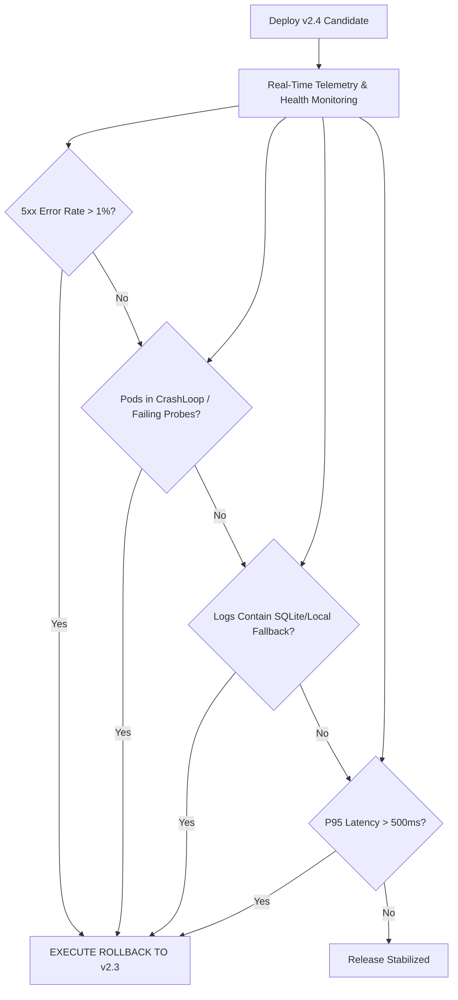

# Production Rollback Plan

**Target Service:** Checkout API (`checkout-api`)  
**Deployment Target:** `v2.4` (Release Candidate)  
**Known-Good Rollback Target:** `v2.3` (Stable Production Baseline)  
**Effective Date:** 2026-08-20  
**Target MTTR / RTO:** < 2 Minutes  

---

## 1. Objective & Scope

This document defines the automated triggers, operational procedures, and verification criteria to immediately revert the **Checkout API** from candidate release **v2.4** back to stable baseline **v2.3** in the event of an operational degradation, deployment failure, or data consistency anomaly.

---

## 2. Baseline Release Identification

Based on architectural documentation (`docs/architecture.md`) and deployment history:

| Release Version | Release Date | Production Status | Image Digest / Tag | Validation Status |
| :--- | :--- | :--- | :--- | :--- |
| **v2.3** | 2026-06-01 | **Current Stable Baseline (Rollback Target)** | `kalvium/checkout-api:v2.3` | ✅ Proven stable in production |
| **v2.4** | 2026-06-17 | Release Candidate (Target) | `kalvium/checkout-api:v2.4` | ⚠️ Candidate under evaluation |

---

## 3. Rollback Decision Criteria & Trigger Thresholds

The SRE on-call and Release Commander are authorized to trigger an immediate rollback without executive escalation if ANY of the following conditions persist for more than **60 seconds**:



### Specific Trigger Metrics
1. **HTTP 5xx Spike:** Error rate exceeding 1.0% over a 1-minute rolling window.
2. **Health Check Failure:** Pods failing readiness/liveness probes or restarting.
3. **Fallback Execution:** Log pattern match for `DATABASE_URL is not set` or `REDIS_URL is not set` (indicating multi-pod state fragmentation).
4. **Latency Degradation:** P95 response time exceeding 500ms.
5. **Checkout Anomaly:** Cart checkout failure rate > 0.5% reported by payment gateway integration.

---

## 4. Step-by-Step Rollback Execution

### Step 1: Initiate Immediate Rollout Undo
Execute the Kubernetes deployment rollback command to revert to the previous revision:

```bash
# Option A: Instant Kubernetes Rollout Reversion
kubectl rollout undo deployment/checkout-api -n checkout-system
```

If revision history is unavailable or ambiguous, execute direct declarative image pinning:

```bash
# Option B: Direct Image Reversion to Known-Good Baseline
kubectl set image deployment/checkout-api checkout-api=kalvium/checkout-api:v2.3 -n checkout-system
```

---

### Step 2: Track Rollout Progress
Monitor the pod recreation and health transition:

```bash
kubectl rollout status deployment/checkout-api -n checkout-system --timeout=120s
```

*Expected output:*
```text
Waiting for deployment "checkout-api" rollout to finish: 1 of 3 updated replicas are available...
Waiting for deployment "checkout-api" rollout to finish: 2 of 3 updated replicas are available...
deployment "checkout-api" successfully rolled out
```

---

### Step 3: Emergency Quick Fallback Script (`scripts/rollback.sh`)
An automated rollback script is prepared for one-command operational execution:

```bash
#!/bin/bash
set -euo pipefail

NAMESPACE="checkout-system"
DEPLOYMENT="checkout-api"
STABLE_IMAGE="kalvium/checkout-api:v2.3"

echo "[$(date -u)] INITIATING EMERGENCY ROLLBACK TO ${STABLE_IMAGE}..."

# 1. Update image
kubectl set image deployment/${DEPLOYMENT} ${DEPLOYMENT}=${STABLE_IMAGE} -n ${NAMESPACE}

# 2. Wait for rollout completion
kubectl rollout status deployment/${DEPLOYMENT} -n ${NAMESPACE} --timeout=90s

# 3. Verify pods
kubectl get pods -n ${NAMESPACE} -l app=checkout-api

echo "[$(date -u)] ROLLBACK COMPLETE. Running verification checks..."
```

---

## 5. Post-Rollback Verification Checklist

Following rollback execution, the operational lead must execute and log the following 6 verification gates:

| Gate # | Verification Check | Command | Expected Result | Pass/Fail |
| :---: | :--- | :--- | :--- | :---: |
| **1** | Pod Status & Replicas | `kubectl get pods -n checkout-system -l app=checkout-api` | 3/3 pods `Running`, 0 restarts | [ ] |
| **2** | Image Version | `kubectl get deployment checkout-api -n checkout-system -o jsonpath='{.spec.template.spec.containers[0].image}'` | `kalvium/checkout-api:v2.3` | [ ] |
| **3** | Version Endpoint | `curl -s http://checkout-api-service.checkout-system.svc/ \| jq .version` | `"v2.3"` | [ ] |
| **4** | Health Endpoint | `curl -s http://checkout-api-service.checkout-system.svc/health \| jq .status` | `"healthy"` (with connected DB & Redis) | [ ] |
| **5** | Log Sanitation | `kubectl logs -n checkout-system -l app=checkout-api --tail=50` | Zero warning logs regarding SQLite/cache fallback | [ ] |
| **6** | Payment Integration | Synthetic checkout probe (`POST /api/v1/checkout/test`) | HTTP 200, transaction persisted | [ ] |

---

## 6. Incident Escalation & Communication Protocol

1. **Slack Alert:** Post incident notice to `#eng-incident-response` and `#checkout-releases`.
   - *Message Template:* `[ALERT] Rollback executed for Checkout API. Version reverted from v2.4 to v2.3. System stabilized. Incident investigation underway.`
2. **Customer Support Sync:** Inform customer support lead on status of affected transactions during the deployment window.
3. **Post-Mortem Requirement:** Schedule a blameless post-mortem within 24 hours to analyze the root cause of the candidate failure.
